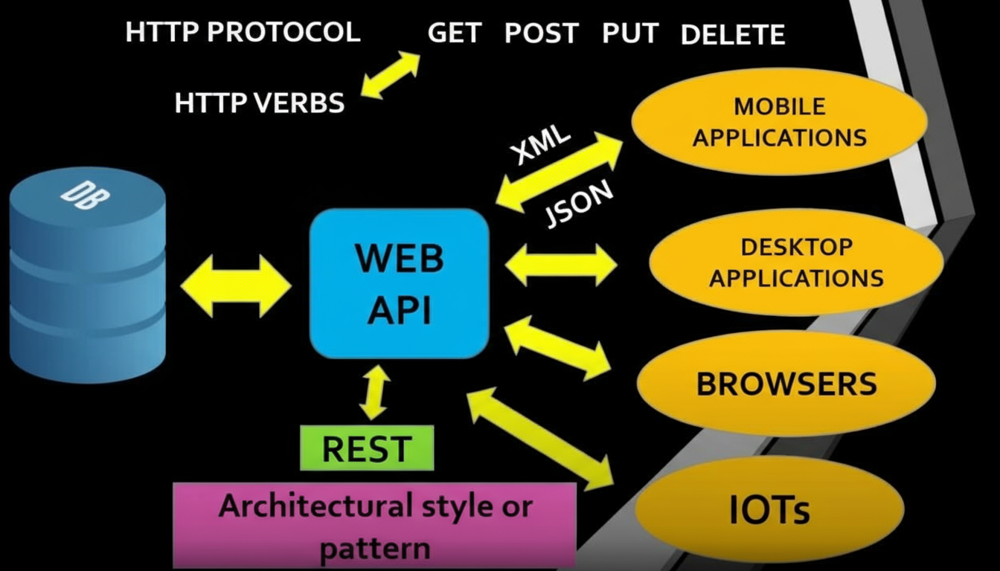
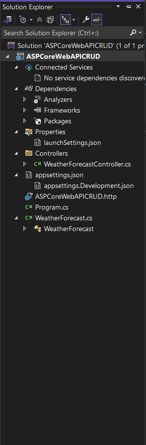
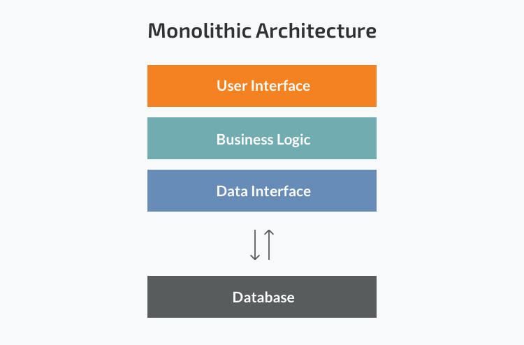
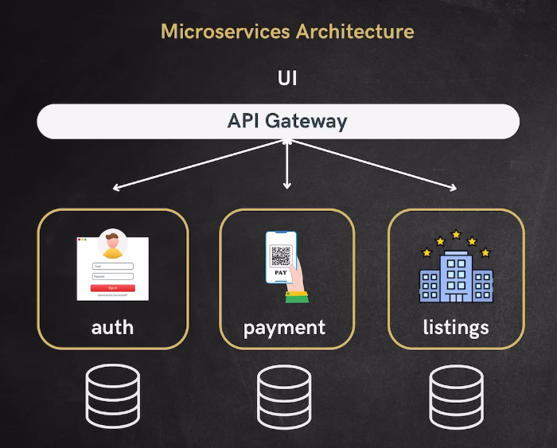



# Microsoft.NET Core (Moving from Only One Windows platform to Multiple platforms such as MacOS,Linux for development and execution)

  ## Difference between .NET Framework and .NET Core

  | Feature                        | .NET Framework                                  | .NET Core / .NET (Modern)                      |
  |--------------------------------|-------------------------------------------------|------------------------------------------------|
  | Platform Support               | Windows only                                    | Cross-platform (Windows, macOS, Linux)         |
  | Open Source                    | No                                              | Yes                                            |
  | Application Types              | Desktop, Web, Windows Services                  | Web, Cloud, Console, Microservices, IoT, etc.  |
  | Deployment Model               | System-wide, requires installation              | Side-by-side, self-contained, or framework-dependent |
  | Performance                    | Good, but less optimized for modern workloads   | High performance, optimized for modern workloads|
  | API & Library Availability     | Mature, large set of APIs                       | Growing, but some APIs not available           |
  | Updates                        | Infrequent, mostly security/bug fixes           | Frequent, with new features and improvements   |
  | Support for Containers         | Limited                                         | Full support (Docker, Kubernetes, etc.)        |
  | Modern Language Features       | Limited support for latest C# features          | Full support for latest C# features            |
  | Cloud Support                  | Limited                                         | Designed for cloud and microservices           |
  | Microsoft Support              | Mainstream support ended for older versions     | Actively supported and developed               | 

  ## Why To Use 

  - **Open Source**:-Before Open Source microsoft provide Close Source which is only view and execute no modification in code,
    But when open source came into picture its free to use and has a large community of developers who contribute to its development and support.
       
       - **Cost-Effective**:- Being open source and cross-platform, it can reduce development and deployment costs compared to proprietary solutions.
       - **Language Support**:- Supports multiple programming languages, including C#, F#, and Visual Basic, providing flexibility for developers. 
       - **Fast Development**:- With a rich set of libraries and tools, developers can build applications quickly and efficiently.
       - **Performance**:- Known for its high performance and scalability, making it suitable for building high-performance applications.
       - **Microservices Architecture**:- Well-suited for building microservices-based applications, allowing for modular (controller over files due to folder structure Controller,Respository,BL,DAL) and scalable development.
       - **Containerization**:- Works well with containerization technologies like Docker, making it easier to deploy and manage applications in various environments.
  
  - **Cross-Platform**:- Can run on Windows, macOS, and Linux, making it versatile for different development environments.
  
       - **Versatile**:- Supports a wide range of application types, including web, mobile, desktop, gaming, and IoT applications.
       - **Integration with Microsoft Ecosystem**:- Seamlessly integrates with other Microsoft products and services, such as Azure, Visual Studio, and SQL Server.
       - **Modern Development Practices**:- Supports modern development practices, including DevOps, continuous integration/continuous deployment (CI/CD), and agile methodologies.
  
  - **Cloud Applications**:- So due to open source and cross platform microsoft designed with cloud applications in mind, making it suitable for modern application development.
  - **Community and Support**:- Has a large and active community, along with extensive documentation and support from Microsoft.
  - **Regular Updates**:- Microsoft actively maintains and updates .NET Core, ensuring it stays current with the latest technologies and security standards.  
  

  ## Installation Steps
  
  - Step 1:- Download the .NET SDK from the official Microsoft website: https://dotnet.microsoft.com/download

  - Step 2:- Choose the appropriate version for your operating system (Windows, macOS, or Linux) and follow the installation instructions provided on the website.

  - Step 3:- Verify the installation by opening a terminal or command prompt and running the following command:
  
      Syntax:
       
      ```bash
    
        dotnet --version

      ```  

  ## Create a New .NET Core Project
  - Step 1:- Open a terminal or command prompt.
  - Step 2:- Navigate to the directory where you want to create your new project.
  - Step 3:- Run the following command to create a new console application:  
      Syntax:   
      ```bash
    
        dotnet new console -n MyFirstDotNetApp

      ```
  - Step 4:- Navigate into the project directory:
      Syntax:      
      ```bash
    
        cd MyFirstDotNetApp

      ```
  - Step 5:- Run the application using the following command:  
      Syntax:
      
      ```bash
    
        dotnet run
  
      ```   
  - Step 6:- You should see the output "Hello, World!" in the terminal, indicating that your .NET Core application is running successfully.  
  - Step 7:- You can now start developing your .NET Core application by modifying the `Program.cs` file in the project directory.  
  - Step 8:- To add additional packages or libraries to your project, you can use the `dotnet add package` command followed by the package name.  
  - Step 9:- To build your project, use the following command:  
      Syntax:
      
      ```bash
    
        dotnet build
  
      ```
  - Step 10:- To publish your application for deployment, use the following command:  
      Syntax:
      
      ```bash
    
        dotnet publish -c Release -o ./publish
  
      ```
  - Step 11:- This will create a publish directory with the compiled application files that you can deploy to your desired environment.
  
***

# Web API (Apllication Programing Interface Over Web)

  ## What is Web API?

  
  
  - Set of function and protocols that allows different software applications clients (Web, Mobile, IOS, macOS, IoT,etc) to communicate and interact with each other over Internet.   
  - Web API that follows REST Architecture style and pattern as 
     - Standard of calling/trigger URLs throught http protocal/http verbs (GET, POST, PUT, DELETE) 
     - Message passing requests and getting responses in proper message format (Text, XML, JSON(Latest widely used)).  

     Then Web API is called RESTful Web API.
  
  ## Why Use Web API?
  
  - **Interoperability**: Due to Cross-Platform, APIs access and comunicate with different device,software and application .  
  - **Modularity**: Helps developers can break down complex systems into smaller, manageable components. Each component can be developed, tested, and maintained independently, leading to more efficient development processes.  
  - **Reusability**: APIs allow developers to reuse existing functionality without having to reinvent the wheel. This saves time and effort, as developers can leverage pre-built services and libraries.  
  - **Scalability**: APIs facilitate the scaling of applications by allowing different components to be updated or replaced without affecting the entire system. This makes it easier to adapt to changing requirements or technologies.  
  - **Security**: APIs can provide controlled access to resources and data, allowing developers to implement authentication and authorization mechanisms. This helps protect sensitive information and ensures that only authorized users can access certain functionalities.  
  - **Innovation**: By exposing certain functionalities through APIs, organizations can encourage third-party developers to create new applications or services that enhance their offerings. This fosters innovation and      

  ## Rules of RESTful Web API
  - **Stateless**: Client provides all information for each request, server dosen't store any client information.
  - **Client-Server Architecture**: Client and server are separate entities that communicate over a network. 
  - **Uniform Interface**: Clinet should need to follow standardized way of interacting with resources using HTTP methods/HTTP verbs (GET, POST, PUT, DELETE).  
  - **Cacheable**: Response from Web API cached/stroe in client to avoid unwanted trigger/calling Web API to avoid load over it.
  - **Layered System**: Web API can be composed of multiple layers, each with specific responsibilities (e.g., authentication, logging, etc.)
  - **Code on Demand (Optional)**: Server can send response with only data as per client request, not extra or unwanted data.
  
  ***
# .Net Core Web API 

 ## Steps To Create Project  
 
  - Open Visual Studio 2022.
  - Step 2:- Click on "Create a new project".
  - Step 3:- In the "Create a new project" dialog, select "ASP.NET Core Web API" from the list of templates and click "Next".
  - Step 4:- Enter a name for your project, choose a location to save it. 
     1.  If you want to add solution file within project then check "Place solution and project in the same directory" checkbox.
     
     Then click "Next".
  - Step 5:- In the "Additional information" dialog, select the following options:
     1.  Choose the target framework version (e.g., .NET 6.0 (Long Term Support) or .NET 7.0 (Long Term Support)) in a way that it is providing Long Term Support.
     2.  Authentication Type: Select "None" for no authentication.
     3.  If you want secured your Web API request/response protocal then check "Configure for HTTPS" checkbox.
     4.  If your Web API is having a concept of Container then check "Enable Container Support" checkbox and choose the appropriate Container OS operating system (Linux or Windows).
          And also select Container Build Type (Docker or Docker Compose).
     5.  If you want to use in-built Web API Testing Tool (e.g., Internal Testing Tool - Swagger, External Testing Tool - Postman) then check "Enable OpenAPI Support" checkbox.
     6.  If Web API required controller then select "Use controllers" checkbox.
     7.  If you want base level code template/structure like code in Program.cs,etc, then uncheck "Do not use top-level statements" checkbox.
    
    Then click "Create".  
      
  
 ## Files and Folders Structure And Its Role

 

  - **Program.cs**: Entry point of the application. It configures and starts the web host, sets up middleware, and defines routing for the API endpoints.
  
      - **var builder = WebApplication.CreateBuilder(args);**: Initializes a new instance of the WebApplicationBuilder class, which is used to configure the application.
      - **builder.Services.AddControllers();**: Registers the controllers with the dependency injection container, allowing them to be resolved and used in the application.
      - **var app = builder.Build();**: Builds the application and prepares it to handle incoming requests.
      - **app.UseHttpsRedirection();**: Middleware that redirects HTTP requests to HTTPS for secure communication.
      - **app.UseAuthorization();**: Middleware that enables authorization for protected resources in the API.
      - **app.MapControllers();**: Maps controller routes to their corresponding endpoints, allowing them to handle incoming requests.
      - **app.Run();**: Starts the application and begins listening for incoming requests.
  
  - **Controllers Folder**: Contains controller classes that handle incoming HTTP requests and return responses. Each controller typically corresponds to a specific resource or functionality in the API.  
      - **WeatherForecastController.cs**: A sample controller that demonstrates how to create endpoints for handling HTTP requests. It includes methods for GET requests to retrieve weather forecast data.
  
  - **appsettings.json**: Configuration file that contains settings for the application, such as connection strings, logging settings, and other configuration options.
  - **Properties Folder**: Contains project properties and settings, including launch settings for debugging and running the application.
  - **Dependencies Folder**: Lists all NuGet packages and project references that the application depends on.
  
 ## Running Project
  - Step 1:- Open Visual Studio 2022 and load your .NET Core Web API project.
  - Step 2:- Set the desired launch profile (e.g., IIS Express or Project) from the dropdown menu next to the "Run" button in the toolbar.
  - Step 3:- Click on the "Run" button (or press F5) to start debugging the application. This will build the project and launch it in your default web browser.
  - Step 4:- If you have enabled OpenAPI support (Swagger), you will see a Swagger UI page that lists all available API endpoints. You can use this interface to test your API by 

 ## Main Concepts Of Projects
  
  1. **Controller** :- 
      
     Each Controller, 
       - **ControllerBase class** :- Controller is derived class of ControllerBase class which internal handles the incoming HTTP requests and outgoing HTTP responses. It provides various methods and properties to work with HTTP requests and responses, such as accessing request headers, query parameters, and request body data. It also provides methods for returning different types of responses, such as JSON, XML, or plain text.   
       - **APIController Attribute** :- This attribute is used to indicate that a class is a Web API controller. It provides additional functionality and behavior specific to Web API controllers, such as attribute routing, automatic model validation and response formatting.

  
  2. **Dependency Injection (DI)** :- 
     
     - **Service Registration** :- In the Program.cs file, services are registered with the dependency injection container using the builder.Services collection. This allows you to configure and manage dependencies for your application.
     - **Service Resolution** :- When a controller or other component requires a service, it can request it through constructor injection. The dependency injection container will automatically resolve and provide the required service instance.
     - **Service Lifetimes** :- Services can be registered with different lifetimes, such as Singleton (one instance for the entire application), Scoped (one instance per request), or Transient (a new instance each time it is requested). This allows you to control the lifecycle of your services based on your application's needs.

***

# Monolathic vs Microservices Architecture
  ## Monolithic Architecture
  
  - In Monolithic Architecture, the entire application is built as a single, cohesive unit. All components and functionalities are tightly integrated and run within a single process. This means that any changes or updates to one part of the application may require redeploying the entire application.
  
  - **Advantages**:
     - Simplicity: Easier to develop, test, and deploy as a single unit.
     - Performance: Direct communication between components can lead to better performance.
     - Easier Debugging: Debugging is straightforward since all code is in one place.
  
  - **Disadvantages**:
     - Scalability: Difficult to scale individual components independently.
     - Maintenance: As the application grows, it can become complex and harder to maintain.
     - Deployment: Any change requires redeploying the entire application, leading to potential downtime.
     
  ## Microservices Architecture
  
  - In Microservices Architecture, the application is divided into smaller, independent services that communicate with each other through APIs. Each service is responsible for a specific functionality and can be developed, deployed, and scaled independently. This allows for greater flexibility and agility in development and deployment.
  - **Advantages**:
     - Scalability: Individual services can be scaled independently based on demand.
     - Flexibility: Different services can use different technologies and programming languages.
     - Resilience: Failure in one service does not necessarily impact the entire application.
     - Faster Development: Teams can work on different services simultaneously, speeding up development.
  - **Disadvantages**:
     - Complexity: Managing multiple services can be complex and requires robust orchestration.
     - Communication Overhead: Services need to communicate over the network, which can introduce latency.
     - Data Consistency: Ensuring data consistency across services can be challenging.
     
     
  ## When to Use Which?
  - **Monolithic Architecture** is suitable for:
     - Small to medium-sized applications with limited complexity.
     - Applications with a stable feature set that do not require frequent updates.
     - Teams with limited resources or experience in managing distributed systems.
  - **Microservices Architecture** is suitable for:
     - Large-scale applications with complex functionalities that require frequent updates.
     - Applications that need to scale specific components based on demand.
     - Teams with experience